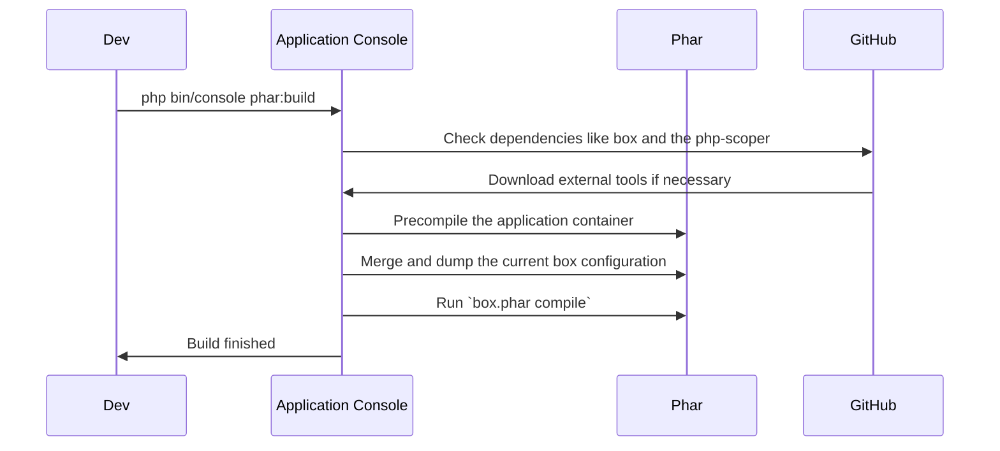

# Behind the Scenes

Roughly, this is what happens during a `phar:build`:

```mermaid
sequenceDiagram
  participant D as Dev
  participant S as Application Console
  participant P as Phar
  participant G as GitHub

  D->>S: php bin/console phar:build
  S->>G: Check dependencies like box and the php-scoper
  G->>S: Download external tools if necessary 
  S->>P: Precompile the application container
  S->>P: Merge and dump the current box configuration
  S->>P: Run `box.phar compile`
  S->>D: Build finished
```

